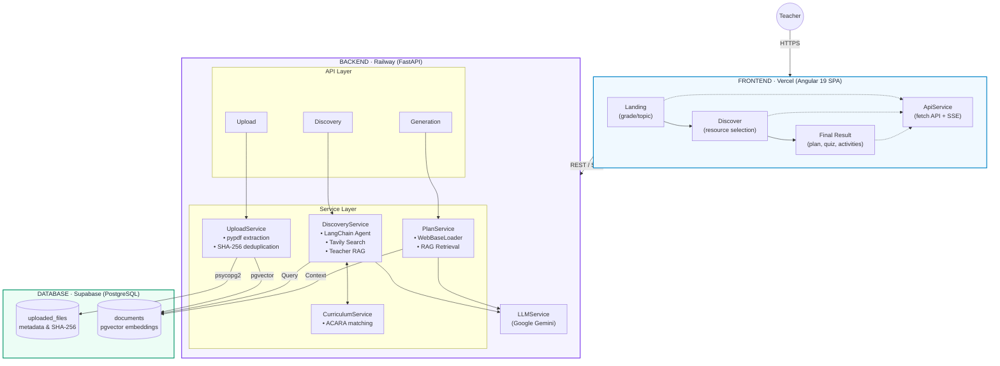

# Drona-AI
## Hackathon Project

---

## Introduction

### Challenge Statement
Design and create a teacher-facing solution that helps educators find, evaluate, and adapt safe, high-quality online resources tailored to their localised context and needs, while ensuring trust, reliability, and transparency.

### Our Solution
Drona-AI solves this challenge by providing a transparent, AI-powered pipeline that helps Australian teachers build curriculum-aligned educational materials in minutes:
- **Localized Context:** Automatically maps resources to the **Australian Curriculum (ACARA)** and includes a dedicated toggle for **First Nations Perspectives**.
- **High-Quality Discovery:** Combines a specialized web search agent (Tavily) with a RAG system that prioritizes trusted educational domains and the teacher's own uploaded documents.
- **Trust & Transparency:** Every generated plan includes **explicit citations** of the source material and direct mapping to curriculum codes, ensuring the AI's output is grounded and verifiable.
- **Adaptability:** Teachers can instantly differentiate content by difficulty level and use follow-up "chips" to refine, simplify, or extend the lesson for their specific classroom needs.

---

## System Architecture

Drona-AI is a two-tier web application: an Angular SPA served from Vercel talks to a FastAPI backend hosted on Railway. The backend orchestrates an AI pipeline that combines a web search agent, a RAG (Retrieval-Augmented Generation) system, and a streaming LLM to help teachers build curriculum-aligned lesson plans.

### Architecture Diagram



### Request Flow

**1. Landing → Discover**
The teacher enters grade, subject, state, and topic. The frontend calls the discovery endpoint. The backend's `DiscoveryService` runs a LangChain agent that fires two tools in parallel: `search_web_resources` (Tavily Search) and `search_teacher_documents` (RAG query against PGVector). Results are ranked by ACARA curriculum alignment and returned as a structured `ResourceList`.

**2. Discover → Final Result**
The teacher selects resources and clicks generate. The frontend opens an SSE connection to the generation endpoint. The `PlanService` scrapes the selected web URLs, retrieves the selected teacher documents from PGVector, builds a single prompt enriched with curriculum context, and streams the Gemini response token-by-token back to the browser. The same flow is repeated on demand for quiz, activities, and keywords generation.

---

## Content Generation

All generated content follows the same three-phase pipeline: **gather context → build prompt → stream response**. Each output type has a dedicated prompt template, but they all share the same input: the teacher's selected resources, scraped web content, retrieved teacher documents, and matched ACARA curriculum outcomes.

### Study Plan

The study plan is the primary output. The prompt instructs Gemini to act as an **Australian curriculum designer** and produce a complete, ready-to-use markdown lesson plan that includes:

- **Learning objectives** mapped explicitly to ACARA content descriptor codes
- **A structured lesson sequence** with estimated timeframes (using ⏱️)
- **Core learning activities** split into analysis and hands-on build columns
- **Curated resource citations** referencing the exact URLs and documents the teacher selected
- **A mastery assessment** section with a capstone project and rubric hints
- Australian context flagged with 🇦🇺 throughout
- LaTeX rendering for any mathematical or scientific notation

The prompt is parameterised with grade, subject, state, topic, timeline (weeks), and an optional additional context field the teacher can fill in.

### Quiz

The quiz prompt reuses the same gathered context but reshapes the output into a structured three-part assessment:

- **Part A** — 5 multiple choice questions with an answer key at the end
- **Part B** — 3 short answer questions with marking criteria
- **Part C** — 1 extended response / analysis question

The teacher can set a **difficulty level** (Beginner / Intermediate / Advanced) which is injected into the prompt to calibrate question complexity. Questions with Australian context are flagged with 🇦🇺, and math/science questions use LaTeX formatting.

### Activities

The activities prompt generates 3–5 distinct classroom activities spanning different formats (hands-on, collaborative, research-based, creative). Each activity is structured with:

- Activity name, estimated duration, and grouping (individual / pairs / groups)
- Materials needed
- Step-by-step instructions
- Australian context where applicable

Like the quiz, activities support a **difficulty level** parameter so teachers can differentiate for their class.

### Keywords List

The keywords prompt extracts 10–15 essential vocabulary terms from the topic and selected resources. Each keyword entry includes:

- A clear, grade-appropriate definition
- An example sentence or context, prioritising Australian examples (🇦🇺)

This output is designed to be used directly as a student vocabulary reference or printed glossary.

### List Uploaded Files

Returns a list of all documents currently indexed in the RAG system:
- File name and original size
- Upload timestamp
- Unique document ID for reference

### Follow-up Chips

After the initial study plan is generated, the frontend surfaces a set of suggested follow-up actions:

> "Generate a quiz" · "Simplify for struggling students" · "Add First Nations perspectives" · "Create a differentiated version" · "Generate discussion questions" · "Make a rubric"

These chips let teachers quickly request additional content without navigating back through the full flow.

---

## Setup & Running

### Prerequisites

- [Node.js & npm](https://nodejs.org/)
- [Python 3.11+](https://www.python.org/downloads/)
- [uv](https://astral.sh/uv)

### Frontend

```bash
cd everest
npm install
ng serve
```

Runs at `http://localhost:4200`

### Backend

```bash
cd mariana
uv sync
uv run fastapi dev main.py
```

Runs at `http://localhost:8000`
